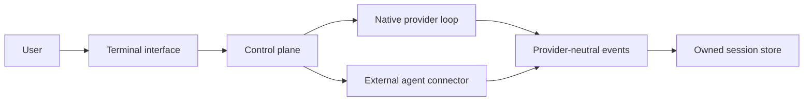

# Plan: Gritt agent workspace

[HTML version](plan1.html)

## Objective

Build Gritt, an open-source Rust application for running AI coding agents from one place. The first release targets macOS, Windows, and Linux. It starts as a terminal program and grows into a control plane with another frontend later. The repository keeps the name `gritt-cli` for now.

Gritt gives the user two ways to run work:

1. Native path. The user supplies an API key for a model provider. Gritt runs its own agent loop, tools, permissions, and sessions against that provider.
2. Connector path. The user prefers an installed agent such as Codex, Claude Code, Cursor, or OpenCode. Gritt launches and supervises that agent. The agent keeps its own command and tool authority. Gritt shows its activity, relays approvals, and stores the session alongside native ones.

Both paths feed one event model, one session store, and one interface. Planning is conversational. Coding is the tool-using execution phase. Both phases remain in one session.

## Providers

First-version providers, each reachable with a key the user already holds:

| Provider | Protocol | Key |
| --- | --- | --- |
| OpenRouter | OpenAI-compatible Chat Completions | `OPENROUTER_API_KEY` |
| OpenAI | Responses and Chat Completions | `OPENAI_API_KEY` |
| Anthropic | Messages | `ANTHROPIC_API_KEY` |
| Any OpenAI-compatible endpoint | Chat Completions with a configured base URL | user-named variable |

Routing is by configured provider profile, never by guessing from a model name. The generic OpenAI-compatible profile is how a private or self-hosted endpoint is added later without new code.

### Model lists

Each provider adapter fetches its own model list (`GET /models` on OpenRouter and OpenAI, `GET /v1/models` on Anthropic) and caches it on disk with a fetch timestamp. Gritt refreshes at most once per day. On fetch failure it uses the last cached list and marks it stale. Where a provider reports capabilities, Gritt records them and does not advertise a feature the provider does not report.

### Adapter contract

One internal trait sends a prompt and streams provider-neutral events, submits tool results, restores a session from stored continuation state, reports capabilities for a selected model, and reports errors in internal error kinds. Provider-specific fields travel only as optional diagnostic metadata on events. Nothing above an adapter learns which provider served a request.

Implementation order: OpenAI-compatible Chat Completions first, because it covers OpenRouter and the generic profile. Then OpenAI Responses. Then Anthropic Messages.

### Normalizers

Keep one normalizer per wire envelope: Chat Completions (`choices[]` and streamed deltas), Responses (top-level `output` items and the `response.*` event set, with `previous_response_id` continuation), and Anthropic Messages (`content` blocks and `message_*` and `content_block_*` events). They share the event model, not parsing code.

### Tools and schemas

Tool definitions are generated per adapter, because accepted JSON schema dialects and optional fields differ across providers. Keep schema quirks inside the adapter that needs them.

## Keys

- Keys come from the operating system credential store first, then the named environment variable. A config file names the variable that carries a key. It never holds the value. Loading a config that contains a key fails loudly.
- Entering a key in the interface stores it in the keychain, not in a file.
- Keys never appear in logs, fixtures, errors, or transcripts.
- If no keychain is available, environment-only operation remains supported.

## Sessions and events

Streamed text, reasoning summaries, tool calls, tool results, approvals, usage, status changes, errors, and completion are provider-neutral events. Native sessions and connector sessions produce the same event types, with a source field.

Sessions are named, listable, resumable, and removable, and are owned by Gritt. Continuation state an adapter needs is stored behind the session interface. The model leaves room for child sessions from the start; they are a later milestone.

## Permissions and built-in tools

A policy engine with `allow`, `ask`, and `deny` outcomes, matched on tool name and resource, with wildcard resource rules and workspace-aware defaults. It runs before every tool execution on the native path. Native tools include workspace-bounded file read, file write, and shell execution. On the connector path, the external agent retains its documented authority. Gritt relays approval requests and records the decision.

First-version native tools: file read and write within the workspace, and shell execution under approval. Child processes are tracked so cancellation stops them.

## Harness and interface

Terminal first. Ratatui 0.30.2 with Crossterm 0.29 provides the full-screen UI on macOS, Windows, and Linux. Print mode (one prompt in, streamed text out, scriptable) is the fallback every feature degrades to. REPL mode adds history and continuation. The full-screen harness adds a streamed transcript with tool activity, a multiline prompt editor, a status bar (model, provider, session, usage, connection), tool approval views, diff review before file writes, cancellation, a command palette, and task views.

Reference projects for interaction design are OpenCode's permission model, Warp's terminal and agent mode split, and T3 Code's local multi-agent workspace. Study behavior and reimplement. Do not copy source, and do not add Git dependencies without a license and maintenance review.

## Connectors

The connector contract is a normalized event stream: start a task with a prompt and workspace, send follow-up input, stream events, answer an approval, cancel, resume or inspect when supported, and report capabilities, version, and auth state.

The native path is the first connector so the control plane never special-cases it. External connectors launch the installed agent through a PTY or its documented machine-readable interface, preferring structured output. Terminal scraping is a last resort. Each connector is optional. A missing or outdated agent never breaks the native path. Capability differences are shown, not faked.

Order: native, Codex, Claude Code, then Cursor and OpenCode after their interfaces are evaluated.

## Configuration

Precedence: command-line flags, then project config, then user config, then environment variables, then built-in defaults.

Config holds provider profiles (protocol, base URL, key variable name), model aliases, default model and provider, list refresh policy, tool policy, connector settings, and interface preferences. Structured logs are content-free by default. Explicit content logging retains seven days of data.

## Language and runtime

Rust. One native binary per platform, no runtime dependency at install time. Gritt owns its HTTP clients, SSE parsing, normalizers, tool loop, sessions, and adapters. Vendor SDKs are not a dependency of the product.

## First-version scope

Provider profiles for OpenRouter, OpenAI, Anthropic, and generic OpenAI-compatible endpoints. Model list fetch, daily cache, and stale fallback. Print and REPL modes with streaming. Named sessions with resume. Planning and coding phases. File and shell tools under the permission engine. Clear unsupported-capability and provider errors. Structured, content-free logs by default.

Deferred: plugin systems, embeddings and reranking commands, automatic retry after failed tool calls, multi-agent orchestration beyond child sessions, a desktop front end, and reproducing every feature of the connected agents.

## Phases

### Phase 0: workspace and contracts

- Confirm Rust toolchain, cross-compilation, signing, and release conventions.
- Create the Cargo workspace and crate boundaries.
- Define the event, session, tool, config, and adapter contracts.
- Prototype the HTTPS client and SSE parser against OpenRouter with recorded fixtures.
- Add the terminal shell with Ratatui and Crossterm, with the decision recorded in ADR-009.

Exit: packaging is viable, contracts compile in a crate with no I/O dependency, a streamed request succeeds through OpenRouter, fixtures replay in tests.

### Phase 1: native path

- Chat Completions adapter with OpenRouter and generic profiles.
- Model list fetch and cache.
- Print mode, REPL mode, streaming, sessions, permission engine, file and shell tools, cancellation.
- Streamed transcript and approval prompts in the terminal.

Exit: a user with an OpenRouter key runs a tool-using session end to end in both modes.

### Phase 2: more providers

- OpenAI Responses adapter with continuation.
- Anthropic Messages adapter.
- Per-adapter tool schema generation and capability checks.
- Keychain storage and in-interface key entry.

Exit: the same session works across all three providers with documented capability differences.

### Phase 3: harness

- Full-screen navigation, diff review, command palette, task views, child sessions.
- Session comparison across providers, usage reporting, error polish.
- Release packaging, signing, checksums, diagnostics, upgrade path.

Exit: a new user installs one binary, adds a key, and runs both modes without reading source.

### Phase 4: connectors

- Connector contract and process supervision (PTY, timeouts, cancellation, health checks).
- Native path promoted to the first connector.
- Codex and Claude Code connectors, then Cursor and OpenCode evaluations.
- Multiple threads, connector capability display, cross-connector history.

Exit: the control plane runs the native connector and at least two external ones in one interface and recovers from cancellation, process exit, and connector failure.

## Decisions recorded in ADRs

- The first release supports macOS, Windows, and Linux. See ADR-006 and
  ADR-011.
- The full-screen terminal UI uses Ratatui 0.30.2 with Crossterm 0.29. See
  ADR-009.
- OpenAI profiles support both Responses and Chat Completions. OpenRouter and
  generic endpoints use Chat Completions first. See ADR-007.
- Provider keys use the OS keychain first and the named environment variable
  second. If no keychain exists, environment-only operation is allowed. See
  ADR-008.
- Model lists refresh once per day by default. Failed refreshes use the last
  cached list and mark it stale. See ADR-008.
- Content-free structured logs are the default. Explicit content logging is
  retained for seven days. See ADR-008.
- The first non-terminal frontend uses an in-process API. A local socket is
  deferred until a second process needs it. See ADR-011.
- External connectors retain their documented command and tool authority.
  Gritt supervises, relays approvals, records decisions, and normalizes
  events. See ADR-010.

Model aliases are stored per provider profile. Until a deprecation policy is
accepted, Gritt warns about deprecated aliases and does not remap them.

## Risks

- Provider drift. Wire formats change. Mitigate with recorded fixtures, contract tests per adapter, and capability checks from the provider's model list.
- Connector fragility. External agents change flags, output, and auth. Prefer documented protocols, pin or check versions, run health checks, and isolate each connector.
- Protocol ownership. Rust without vendor SDKs means Gritt maintains compatibility itself. Keep the internal API small and the fixture corpus current.
- Key handling. A leaked key is the worst outcome. Keychain first, environment second, files never.
- Distribution friction. Signing, cross-platform builds, and updates need early testing. Publish reproducible builds with checksums.
- Scope creep. The harness and connector work can swallow the native path. Hold the phase order.
